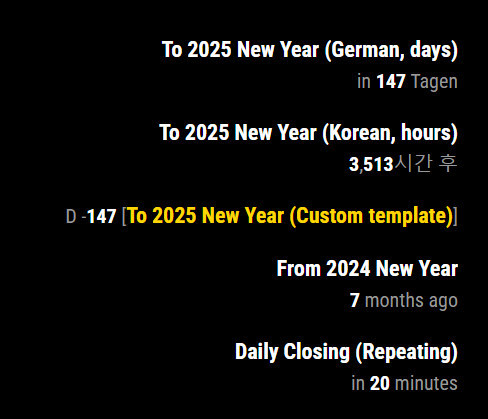
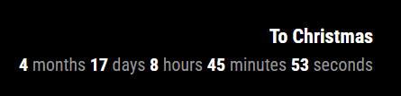
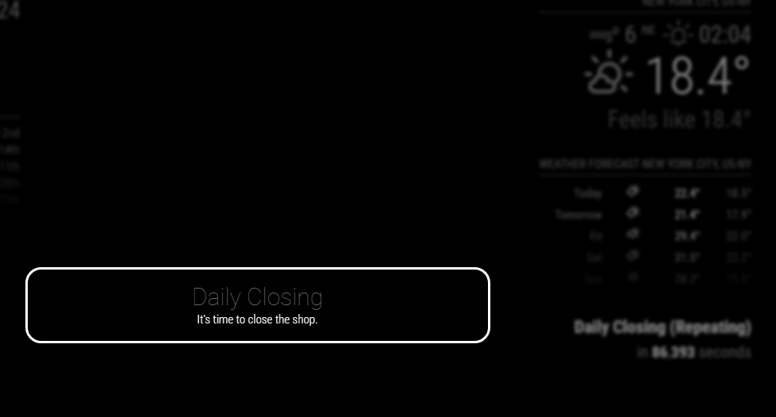

# MMM-CountEvents
Countdown or countup for events

> This module is revamped from the scratch. If you are using the previous version, you may need reinstall again.

## Screenshots




## Features
- Count up / down to specific date/time
- Various formatting & custom template
- Auto repeat : yearly, monthly, daily, hourly.
- Callback functions for updating or passing the event.


## Installation
```sh
cd ~/MagicMirror/modules
git clone https://github.com/MMRIZE/MMM-CountEvents
cd MMM-CountEvents
npm install
```

This module needs `MMM-CustomElementTime` module also. It would be installed by execution of `postinstall.sh`. Usually This script will be run automatically by `npm install` but, when that is not executed properly, do it by manual.
```sh
sh ./postinstall.sh
# OR
./postinstall.sh
```

But when you have still a problem, you can install that module also by manual.
```sh
cd ~/MagicMirror/modules
git clone https://github.com/MMRIZE/MMM-CustomElementTime
```


## Configuration
**IMPORTANT**

You should include `MMM-CustomElementTime` also in the `config.js`
```js
{
  module: "MMM-CustomElementTime" 
},
{
  module: "MMM-CountEvents",
  position: "top_right",
  config: {
    events: [
      {
        title: "To Christmas",
        targetTime: "25 Dec 2024",
      },
    ]
  }
},
```

### Simplest Example
```js
{
  module: "MMM-CountEvents",
  position: "top_right",
  config: {
    events: [
      {
        title: "To Christmas",
        targetTime: "25 Dec 2024",
      },
    ]
  }
},
```
### Detailed (and default)
```js
{
  module: "MMM-CountEvents",
  position: "top_right",
  config: {
    /* Common default properties */
    locale: null,
    refresh: 1000 * 60,
    unit: "auto",
    repeat: false,
    ignoreBefore: false,
    ignoreAfter: false,
    className: "default",
    output: `<dl><dt class="title"></dt><dd class="output"></dd></dl>`,
    numericAlways: false,
    reverse: false,
    numberOnly: false,
    numberSign: false,
    useQuarter: false,
    onPassed: null,
    onUpdated: null,

    events: [
      {
        title: "To Christmas",
        targetTime: "2024-12-25",
        repeat: "yearly",
        ignoreAfter: 1000 * 60 * 60 * 24,
      },
    ]
  }
},
```

### Config values for common default properties
These properties in `config:[]` will be applied to each event by default. You can reassign specific property in each event again.
|Property | default value | Description |
|:---|:---:|:---|
|`locale`|MM's default `locale` or system locale | `BCP-47` format locale identifier. It needs for displaying format by user's locale. <br/> e.g. "de", "en-CA" |
|`refresh`| 60_000 | (ms) self-refreshing interval of the event. `0` means no refreshing.
|`unit`| "auto" | **Available values**: `"auto"`, `"year"`, `"month"`, `"day"`, `"hour"`, `"minute"`, `"second"` and `"quarter"`<br/> `"years"`, `"months"`, `"days"`, `"hours"`, `"minutes"`, `"seconds"` would be available also.|
|`repeat`| false | **Available values**: `"yearly"`, `"monthly"`, `"daily"`, `"hourly"` or `false`<br/> When the event is a kind of recurred events.<br/>`"minutely"` and `"secondly"` are not supported. It sounds weird and out-of-sense.  |
|`ignoreBefore`| false | **Available values**: `false` or `(miliseconds)` <br/> If you set `1000 * 60 * 60 * 24 * 7`, this events will not be displayed before 7days from `targetTime`. |
|`ignoreAfter` | false | **Available values**: `false` or `(miliseconds)` <br/> If you set `1000 * 60 * 60`, this events will not be displayed after 1 hour from `targetTime`.|
|`className`| "default" | You can assign specific CSS class name to the event. |
|`output` | HTML Template | You can modify the output of the event displaying. The element with `title` class and `output` class will be fulfilled with event title and the count result. |
|`numericAlways` | false | The result will be various depends on the locale <br/>`false`: "tomorrow" <br/>`true`: `in 1 day` |
|`reverse` | false | By default (`false`), the displayed time would be counter to the `targetTime` from now. When `true`, vice versa. }
|`numberOnly` | false | Wheter displaying only number (without literals) or not. <br/>`false`: "in 12 hours" <br/>`true`: "12". |
|`numberSign` | false | Displaying `+` or `-` <br/> This will be valid only with `numberOnly: true` options.|
|`useQuarter` | false | Add `quarter` unit into the `unit: "auto"` options. |
|`onPassed` | callback function `(event, element)`| When the `targetTime` is passed, this callback function would be called. Usually this will be used for an alarm function. See the [Examples]<br/>- The check for passing moment is depending on the `refresh` interval.<br/>- When if the event is repeated, this function would be called again at a time.|
|`onUpdated` | callback function `(event, element)` | When the event is refreshed by `refresh` option, this callback function would be called. Usually this will be used for modifying the result on real-time. See the [Examples]|
|`events` | [] | Array of event objects to display. |

### Event object
|Property | default value | Description |
|:---|:---:|:---|
|`title`| "nonamed" | The title of the event. This value will be injected into the first `class="title"` element in `output` template of the event. |
|`targetTime` | "2025-01-01" | The target time of the event. <br/>**Available Types**<br/>- *Unix Timestamp* <br/>- *Date-like String*: See the below [[Time format]] <br/>- *Javascript Date Object* |
> All common default properties could be used and reassigned for the specific evnet object.

## CSS Styling
The displaying result of this module woule have the HTML like this. (with default `output` template)
```html
<div id="module_13_MMM-CountEvents" class="module MMM-CountEvents MMM-CountEvents">
  <header class="module-header" style="display: none;">Module Header</header>
  <div class="module-content">
    <ul class="CE" id="CE_module_13_MMM-CountEvents">
      /* event begin */
      <li class="default"> /* className of the event */
        /* output template begin */
        <dl>
          <dt class="title">Daily Closing (Repeating)</dt> /* title injection */
          <dd class="output"> /* result injection */
            <mm-time relative locale="en-US" time="1723128780000" decouple data-numeric="auto" relative-unit="auto" refresh="1000" class="future default"> /* mm-time custom element to display the targetTime */
              <span class="mm-time-parts literal">in </span>
              <span class="mm-time-parts integer hour">23</span>
              <span class="mm-time-parts literal"> hours</span>
            </mm-time>
          </dd>
        </dl>
        /* output template end */
      </li>
      /* event end */
    </ul>
  </div>
</div>
```

You can handle CSS to style for your purpose.

## Examples
### Various configs


```js
{
  module: "MMM-CountEvents",
  position: "top_right",
  config: {
    events: [
      {
        title: "To 2025 New Year (German, days)",
        targetTime: "2025-01-01",
        locale: "de-DE",
        unit: "days",
      },
      {
        title: "To 2025 New Year (Korean, hours)",
        targetTime: "2025-01-01",
        locale: "ko-KR",
        unit: "hours",
      },
      {
        title: "To 2025 New Year (Custom template)",
        targetTime: "2025-01-01",
        locale: "ja-JP",
        numberOnly: true,
        numberSign: true, 
        unit: "days",
        output: `<div>D <span class="output"></span>(<span class="title" style="color:gold;"></span>)</div>`,
      },
      {
        title: "From 2024 New Year",
        targetTime: "2024-01-01",
      },
      {
        title: "Daily Closing (Repeating)",
        targetTime: "2025-01-01T17:00:00",
        repeat: "daily",
        refresh: 1000,
      }
    ]
  }
},
```
### `onPassed` example for notification alert

```js
{
  module: "MMM-CountEvents",
  position: "top_right",
  config: {
    events: [
      {
        title: "Daily Closing (Repeating)",
        targetTime: "2025-01-01T16:53:00",
        repeat: "daily",
        refresh: 1000,
        onPassed: (event, element) => {
          const self = MM.getModules().withClass("MMM-CountEvents")[0]
          MM.sendNotification(
            "SHOW_ALERT", 
            { type: "alert", title: "Daily Closing", message: "It's time to close the shop.", timer: 60_000 },
            self
          )
        },
      }
    ]
  }
},
```
### `onUpdated` example for displaying **`Years, Months, Days, Hours, Minutes, Seconds`**
This module doesn't provide "OO years, OO months, OO days, OO hours, OO minutes, OO seconds" format, however, you can hook the result with `onUpdated` callback function.


```js
/* event object definition*/
title: "To Christmas",
targetTime: "2024-12-25",
repeat: "yearly",
onUpdated: (event, element) => {
  const pluralMap = { 
    // In 'english-something' locales, 'one' and 'other' are only used. 
    // However, other locales may have more. ('zero', 'two', 'few', 'many' in 'arabic' locale. 'Chinese' locale has only 'other')
    // You need to modify this map according to your locale.
    "year": { one: "year", other: "years" },
    "month": { one: "month", other: "months" },
    "day": { one: "day", other: "days" },
    "hour": { one: "hour", other: "hours" },
    "minute": { one: "minute", other: "minutes" },
    "second": { one: "second", other: "seconds" },
  }
  const pluralRules = new Intl.PluralRules(event.locale)
  const methodMap = {
    FullYear: "year",
    Month: "month",
    Date: "day",
    Hours: "hour",
    Minutes: "minute",
    Seconds: "second",
  }
  const method = (type, name) => { return type + name }
  const upTo = (start, upto, unit) => {
    let count = 0
    const s = new Date(start.valueOf())
    do {
      s?.[method('set', unit)](s?.[method('get', unit)]() + 1)
      count++
    } while (s.valueOf() < upto.valueOf())
    return count - 1
  }
  const [small, big] = [element.time, Date.now()].sort((a, b) => a - b).map(v => new Date(v))
  const moment = new Date(small.valueOf())
  let result = ""
  for (const m of Object.keys(methodMap)) {
    const u = upTo(moment, big, m)
    if (u > 0) {
      moment?.[method('set', m)](moment?.[method('get', m)]() + u)
      result += `<span class="mm-time-parts integer ${methodMap[m]}">${u}</span> <span class="mm-time-parts literal">${pluralMap[methodMap[m]]?.[pluralRules.select(u)]}</span> `
    }
  }
  element.innerHTML = result
}

```

### Time format
For `targetTime`, [ISO 8601](https://en.wikipedia.org/wiki/ISO_8601) and [RFC 2822](https://tools.ietf.org/html/rfc2822#section-3.3) available.


**[RFC 2822]**
```
6 Mar 17 21:22 UT
6 Mar 17 21:22:23 UT
6 Mar 2017 21:22:23 GMT
06 Mar 2017 21:22:23 Z
Mon 06 Mar 2017 21:22:23 z
Mon, 06 Mar 2017 21:22:23 +0000
```

**[ISO 8601]**
```
2013-02-08  # A calendar date part
2013-W06-5  # A week date part
2013-039    # An ordinal date part

20130208    # Basic (short) full date
2013W065    # Basic (short) week, weekday
2013W06     # Basic (short) week only
2013050     # Basic (short) ordinal date

2013-02-08T09            # An hour time part separated by a T
2013-02-08 09            # An hour time part separated by a space
2013-02-08 09:30         # An hour and minute time part
2013-02-08 09:30:26      # An hour, minute, and second time part
2013-02-08 09:30:26.123  # An hour, minute, second, and millisecond time part
2013-02-08 24:00:00.000  # hour 24, minute, second, millisecond equal 0 means next day at midnight

20130208T080910,123      # Short date and time up to ms, separated by comma
20130208T080910.123      # Short date and time up to ms
20130208T080910          # Short date and time up to seconds
20130208T0809            # Short date and time up to minutes
20130208T08              # Short date and time, hours only

2013-02-08 09  # A calendar date part and hour time part
2013-W06-5 09  # A week date part and hour time part
2013-039 09    # An ordinal date part and hour time part

2013-02-08 09+07:00            # +-HH:mm
2013-02-08 09-0100             # +-HHmm
2013-02-08 09Z                 # Z
2013-02-08 09:30:26.123+07:00  # +-HH:mm
2013-02-08 09:30:26.123+07     # +-HH
```

## History
### `2.0.0` (2024-08-07)
- Revamped

## Author
- Author: Seongnoh Sean Yi <eouia0819@gmail.com> 

  [](https://ko-fi.com/Y8Y56IFLK)

- Repository : https://github.com/MMRIZE/MMM-CountEvents
- Version: 2.0.0 (2024-08-07)